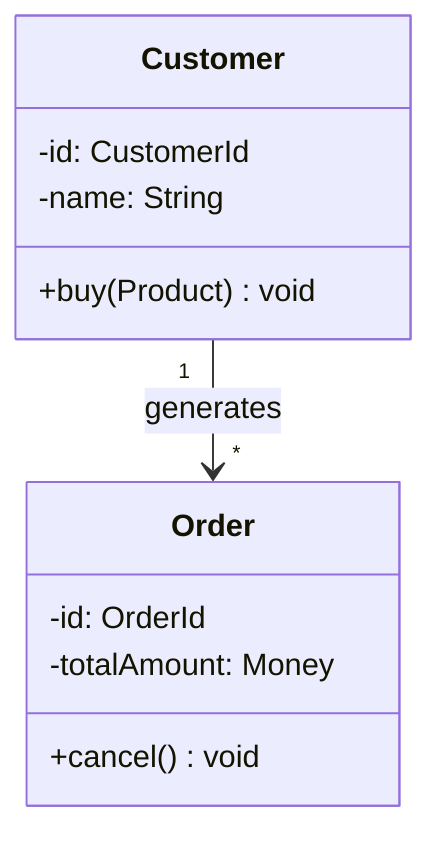

# 第4章：ドメインモデリングガイド
**〜言葉を定義し、ルールの構造を描く（辞書と図）〜**

## 1. はじめに：なぜ「図」と「言葉」が必要なのか
第3章で「何を作るか（スコープ）」が決まりました。では、すぐにコードを書き始めますか？
いいえ。まだ早すぎます。

「注文」とは具体的に何ですか？ キャンセルした注文は「注文」ですか？
「会員」と「ユーザー」は同じものですか？

これらの言葉の定義が曖昧なまま開発を始めると、**「会話」と「コード」がズレ始め、バグの温床になります**。
本章では、DDD（ドメイン駆動設計）の中核となる**「ユビキタス言語辞書」と「ドメインモデル図」**を作成し、チームの共通認識を強固にします。

---

## 2. 思考プロセス：UIからモデルへの翻訳

いきなり図を描くのは難しいです。まずは「ユーザーストーリー（やりたいこと）」から「ドメイン（ルール）」を抽出するワークを行いましょう。

### 抽出ワークの手順

**例：ストーリー「ユーザーとして、商品をカートに入れたい」**

1.  **入力データ (Input):**
    *   この操作をするのに何が必要？ → 「誰が(UserId)」「何を(ProductId)」「何個(Quantity)」
2.  **判定ルール (Validation/Logic):**
    *   どんな時に失敗する？ → 「在庫が足りない時」「販売期間外の時」「1回の注文上限を超えた時」
3.  **変化・結果 (Effect/State Change):**
    *   成功すると何が変わる？ → 「カートの中身が増える」「（あるいは）商品の引当可能数が減る」

**➡ ここから見つかった「名詞」と「ルール」**
*   **名詞:** カート、商品、在庫、ユーザー
*   **ルール:** 在庫チェック、個数制限チェック

これらが、これから定義する「辞書」の項目になり、「モデル図」の箱になります。

---

## 3. パートA：ユビキタス言語辞書 (Dictionary)

コード内のクラス名やメソッド名は、チームの会話で使う言葉と**完全に一致**させます。
ExcelやMarkdownの表形式で管理してください。

### 必須項目

| 項目名 | 説明 |
| :--- | :--- |
| **日本語名** | チーム内の会話で使う言葉。「ユーザー」「データ」のような曖昧な言葉は禁止し、「購入者」「商品カタログ」のように具体的にする。 |
| **英語名** | プログラムのクラス名 (`Purchaser`, `ProductCatalog`)。Google翻訳ではなく、ニュアンスが合うものをチームで決める。 |
| **定義・制約** | その言葉の厳密な境界線。「仮登録状態では購入できない」「出荷後はキャンセル不可」などの**ビジネスルール**をここに書く。 |

### ヒント
*   **動詞も定義する:** 「注文する」「出荷する」といったアクションも重要です。
*   **文脈を分ける:** 同じ「商品」でも、販売時の `SalesItem` と配送時の `Package` は別のモノとして定義した方が良い場合があります。

---

## 4. パートB：概念ドメインモデル図 (Diagram)

辞書で定義した言葉を「箱」にし、それらの関係と構造を図解します。
**注意:** これはデータベースの設計図（ER図）ではありません。データの保存方法ではなく、**「ルールの置き場所」**を決めるための図です。

### 構成要素（DDDの3種の神器）

#### ① エンティティ (Entity)
*   **特徴:** **ID（識別子）**を持ち、属性が変わっても「同じもの」として扱われる。
*   **例:** **ユーザー**（名前が変わってもIDが同じなら同一人物）。

#### ② 値オブジェクト (Value Object)
*   **特徴:** IDを持たず、**「値そのもの」**で識別される。
*   **例:** **金額（Money）**、**メールアドレス**。
    *   ただの `Integer` や `String` ではなく、ロジック（計算や形式チェック）を持ったクラスとして定義します。
    *   ここを妥協しないことが、堅牢なコードへの近道です。

#### ③ 集約 (Aggregate)
*   **特徴:** 必ずセットで扱わなければならないオブジェクトの**「ひとかたまり」**。
*   **例:** **「注文」と「注文明細」**。
    *   「注文」を削除したら「明細」も消える運命共同体。更新する時は必ずこのグループ単位で行う。

### ⚠️ 注意：ER図と混同しないこと
よくある誤解として、**「DBのテーブル設計（ER図）」を描いてしまうこと**が挙げられます。
*   × 悪い例：「usersテーブルとordersテーブルを外部キー `user_id` で結合する」と考える。
*   ○ 良い例：「Userオブジェクトは、Orderオブジェクトを生成する責任を持つ」と考える。

### 図の描き方と推奨ツール
1.  辞書の名詞を箱として置く。
2.  関係線を引く（1対多、参照など）。
3.  **【最重要】箱の中に「ルール（メソッド・制約）」をメモ書きする。**
    *   × 属性だけ：`price: int`
    *   ○ ルール付き：`price: Money`, `add(Money)`, `※マイナス不可`

本プロジェクトでは、Gitで管理しやすい**Mermaid.js** (`classDiagram`) の使用を推奨します。

---

## 5. 運用ルール：辞書と図は「セット」で育てる

*   **同期させる:** 図を描いていて「あ、この名前変えよう」と思ったら、**必ず辞書も更新してください**。逆もまた然りです。
*   **スコープを守る:** 第3章で「対象外」にした機能のモデル図は描かないでください（YAGNI）。

さあ、現実世界の複雑なルールを、美しい構造に落とし込んでみましょう。

---

## 6. 完了定義 (Definition of Done)
次の章に進む前に、以下のチェックをクリアしてください。

*   [ ] 辞書の「英語名」は翻訳ツール任せにせず、チームで合意しているか？
*   [ ] モデル図はER図（テーブル設計）になっていないか？（FKなどのDB用語が出てきていないか）
*   [ ] 箱の中に「属性（データ）」だけでなく「メソッド（振る舞い）」が書かれているか？
*   [ ] **【レビュー】** エンジニアだけでなく、ドメイン知識のある人（PMなど）に見せ、「業務ルールとして違和感がないか」を確認してもらうこと。
