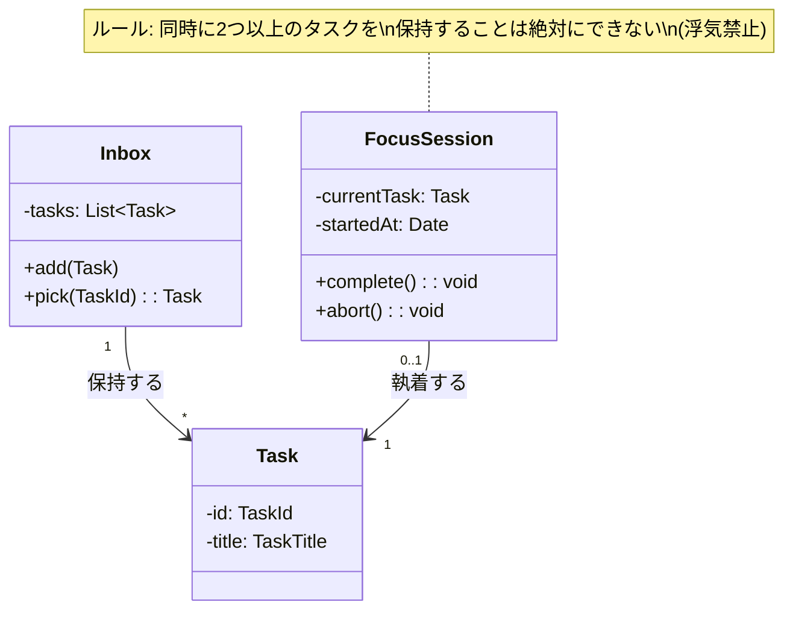

# 第8章：実例集（Sample Documents）
**〜架空のアプリ「OneFocus」におけるドキュメント記述例〜**

このドキュメント群は、**「プロジェクトメンバーが実際に作成した（または作成すべき）成果物のゴールイメージ」**です。

---

## 📂 001_product-vision.md (第1章：コンセプト企画書)

# コンセプト企画書：OneFocus

## 1. 背景・文脈 (Context)
**〜なぜ、今やるのか？〜**
私たちは毎日、大量のタスクに追われています。Jira、Trello、Slackのスター...。
「やるべきこと」を管理するためのツールは沢山ありますが、リストが長くなればなるほど、そのリストを見ること自体がストレスになり、逆に「今はYouTubeを見て逃避しよう」という先延ばしが発生しています。
**「タスク管理ツール自体が、集中力を阻害している」**という矛盾が、私の目の前で起きています。

## 2. ターゲットと核心的欲求 (Who & Pain)
**〜誰の、どんな痛みを解決するのか〜**
* **ターゲット:** 入社1年目のエンジニア（過去の自分）。
* **Pain（痛み）:** 朝、「よしやるぞ」と思ってTODOリストを作るが、20個並んだリストを見て「うわ、こんなにある...」と圧倒され、何から手をつけていいか分からずフリーズしてしまう。
* **Desire（欲求）:** 「これだけやればいい」と誰かに背中を押してほしい。マルチタスクの不安から解放されたい。

## 3. コンセプト・解決策 (Concept)
**〜「シングルタスク」の強制〜**
**「今やる1つ以外、すべて隠す」**禅（Zen）のようなタスク実行ツール。
リスト機能はおまけであり、メインは「1つのタスクだけが画面中央に表示される」フォーカスモードです。

## 4. 実現したい世界 (Vision)
**〜ユーザーはどう変わるか〜**
* **Before:** 「あれもやらなきゃ、これもやらなきゃ」と脳のメモリを浪費し、夕方に「結局何も終わらなかった」と自己嫌悪に陥る。
* **After:** 目の前の1つを倒すことだけにゲーム感覚で集中でき、夕方には「今日はこれだけ進んだ！」という確かな達成感（小さな勝利）を持って帰宅できる。

---

## 📂 002_user-story-map.md (第2章：ユーザーストーリーマップ)

# ユーザーストーリーマップ：OneFocus

## 全体フロー（背骨）
`[頭の中を吐き出す(Dump)]` ➡ `[やることを選ぶ(Select)]` ➡ `[集中して実行する(Focus)]` ➡ `[完了を祝う(Done)]`

## ストーリーの展開とスライシング

### 1. 頭の中を吐き出す (Dump)
* ユーザーとして、思いついたタスクを高速で登録したい。
    * **In Scope:** タイトルだけの入力（Enterで連続登録）。
        * **理由:** 入力項目が多いと、登録自体が億劫になり、頭の中のモヤモヤを吐き出せなくなるから。
    * **Out:** 期限日の設定、タグ付け、詳細メモ。
        * **理由:** 「整理すること」自体を目的にさせないため。

### 2. やることを選ぶ (Select)
* ユーザーとして、今日やるタスクを「Inbox」から選びたい。
* **【重要】** ユーザーとして、**「今からやる1つ」**を宣言したい。
    * **In Scope:** リストから1つ選び「Focus開始」ボタンを押す。
        * **理由:** 自分で「これやる！」と決めるコミットメント（宣言）が、集中スイッチになるから。

### 3. 集中して実行する (Focus)
* ユーザーとして、**選んだタスク以外が見えない状態**になりたい。
    * **In Scope:** 画面中央にタスク名がデカデカと表示される。他のリストへのリンクは隠される。
        * **理由:** 視界からノイズを消すことで、物理的にシングルタスクを強制するため。
    * **Out:** ポモドーロタイマー（25分タイマー）。
        * **理由:** 今回の検証テーマは「隠すことの効果」であり、時間管理機能を入れると変数が混ざって検証の邪魔になるから。

### 4. 完了を祝う (Done)
* ユーザーとして、タスクを完了し、達成感を味わいたい。
    * **In Scope:** 「完了」ボタンを押すと、紙吹雪のエフェクトが出てInboxに戻る。
        * **理由:** 小さな達成感（ドーパミン）を与え、次のタスクへ向かう動機を作るため。

---
**---------- ✂️ PoCスコープライン（ここから下は作らない） ✂️ ----------**

* 過去の完了タスク履歴を見る（ログ機能）
* タスクを編集・削除する（間違えたら完了にしてしまえばいい）
* ログイン機能（ローカル保存で十分）

---

## 📂 003_poc-plan.md (第3章：PoC実行計画書)

# PoC実行計画書：OneFocus MVP

## 1. 検証テーマ (Hypothesis)
「他のタスクを視覚的に隠す（見えなくする）」という体験だけで、ユーザーの**「着手までの迷い時間」は減少するのか？** の検証。

## 2. KPI (数値目標)
検証成功の基準を以下とする。
* **継続率:** ターゲットユーザー3名に使ってもらい、3日連続で使用してくれること。
* **完了率:** 1日に登録されたタスクの「80%」がFocusモード経由で完了されること。

## 3. 対象スコープ (In Scope)
* タスクの追加（タイトルのみ）
* リスト一覧表示
* **フォーカスモード画面（最重要）**
* 完了アクション

## 4. 対象外 (Out of Scope)
**YAGNI原則に基づき、以下は実装しない。**

* **ユーザー認証:** ブラウザのLocalStorageを使用する。（他デバイス同期なし）
    * **理由:** アカウント登録というハードルを排除し、アクセスして1秒で使い始めてもらうため。
* **タスク編集/削除:** 「間違えて登録した」場合も「完了」扱いで消してもらう。
    * **理由:** 「タスクリストを綺麗に整備する」という逃避行動（メタワーク）を防ぐため。
* **ドラッグ＆ドロップ:** リストの並び替えは実装しない。登録順のみ。
    * **理由:** 優先順位を悩む時間があれば、上から順に片付ける習慣を作ってほしいから。

## 5. 品質基準 (Non-negotiables)
* **UI反応:** フォーカスモードへの遷移は、ユーザーのやる気を削がないよう**0.2秒以内**に完了すること。
    * **理由:** 「さあやるぞ」と思った瞬間に待ち時間が発生すると、集中力が途切れるから。

## 6. スケジュール
* 開発期間: 3日間
* デモ日: 11月XX日 15:00〜

---

## 📂 004_domain-modeling.md (第4章：ドメインモデリング)

# ドメインモデリング：OneFocus

## パートA：ユビキタス言語辞書

| 日本語名 | 英語名 | 定義・制約 |
| :--- | :--- | :--- |
| **タスク** | `Task` | ユーザーが実行すべき単位。タイトルを持つ。 |
| **受信箱** | `Inbox` | 未完了のタスクが溜まっている場所。 |
| **フォーカス** | `Focus` | **「今やっている」状態。これになれるのは常に1つのタスクのみ。** (マルチタスク禁止のルール) |
| **完了** | `Complete` | タスクが処理された状態。完了したタスクは画面から消える。 |
| **開始する** | `Start` | InboxにあるタスクをFocus状態にするアクション。**既にFocus中のタスクがある場合はエラーになる。** |

## パートB：ドメインモデル図 (概念図)



---

## 📂 005_api-interface.md (第5章：API・インターフェース定義書)

# インターフェース定義書

## 1. 概要

本MVPではサーバーサイドAPI（REST/GraphQL）を使用せず、LocalStorageを用いたクライアント完結型とする。
そのため、ここでは**「UI層（React）」と「ユースケース層（ロジック）」の境界となるTypeScriptの型定義と関数**を定義する。

UI実装担当者は、このインターフェースが正しく動くことを前提にコンポーネントを実装してよい（実際のロジック実装を待つ必要はない）。

## 2. データ型定義 (Types)

```typescript
// domain/models/Task.ts
export type TaskId = string;

export interface Task {
  id: TaskId;
  title: string;
  createdAt: string; // ISO8601 string
}

export type TaskStatus = 'INBOX' | 'FOCUSING' | 'DONE';
```

## 3. サービスインターフェース (Service Boundaries)

UI層から呼び出すことができる関数群。

### 3.1 タスク取得・操作

| 関数名 | 引数 | 戻り値 | 説明 |
| :--- | :--- | :--- | :--- |
| `useInboxTasks()` | なし | `{ tasks: Task[], isLoading: boolean }` | 未完了タスクの一覧を取得するReact Hook |
| `addTask()` | `title: string` | `Promise<void>` | 新規タスクをInboxに追加する |

### 3.2 フォーカス操作

| 関数名 | 引数 | 戻り値 | 説明 |
| :--- | :--- | :--- | :--- |
| `useCurrentFocus()` | なし | `{ task: Task | null }` | 現在フォーカス中のタスクを取得する。なければnull。 |
| `startFocus()` | `taskId: TaskId` | `Promise<void>` | 指定タスクをフォーカスモードにする。**既に他を実行中の場合はErrorを投げる。** |
| `completeFocus()` | `taskId: TaskId` | `Promise<void>` | フォーカス中のタスクを完了にし、Inboxから消去する。 |

---

## 📂 006_architecture.md (第6章：アーキテクチャ・技術選定書)

# アーキテクチャ設計書

## 1. アーキテクチャパターン

**「軽量オニオンアーキテクチャ」**を採用する。
今回はLocalStorageを使用するためDBサーバーは無いが、将来的なサーバー同期を見据え、ロジックと保存処理を分離する。

### ディレクトリ構成

```text
src/
  ├── domain/         # 【第4章】ビジネスロジック (他層に依存しない)
  │     ├── model/    # Task, Inboxなどのエンティティ・型定義
  │     └── repository/ # ITaskRepository (インターフェース定義のみ)
  │
  ├── application/    # 【第2章】ユースケース (StartFocusServiceなど)
  │     └── usecases/ # 第5章で定義したサービスの実装
  │
  └── infrastructure/ # 【第6章】技術詳細
        ├── local-storage/ # Repositoryの実装クラス
        └── ui/            # Reactコンポーネント (Next.js Pages)
```

## 2. 技術スタック

  * **Framework:** Next.js (App Router)
      * **理由:** Reactのエコシステムを活用しつつ、Vercelへのデプロイが最も簡単で、開発環境構築のコストが低いため。
  * **Language:** TypeScript
      * **理由:** 型安全性を確保し、将来の多人数開発に備えるため。
  * **Storage:** LocalStorage API (ブラウザ内保存)
      * **理由:** サーバー費用ゼロ、実装コスト最小でMVP要件を満たせるため。
  * **Styling:** Tailwind CSS
      * **理由:** クラス名を考える時間を削減し、UI構築のスピードを最大化するため。

## 3. コーディング規約

  * **禁止事項:** UIコンポーネント（`infrastructure/ui`）の中で、タスクの状態変更ロジック（`status = 'DONE'`など）を直接書かないこと。必ず `application` 層のメソッドを呼ぶこと。
      * **理由:** ロジックがUIに散らばると、後で「完了条件を変えたい」となった時に修正漏れが発生するから。

-----

## 📂 007_issue-spec.md (第7章：チケット記述例)

# 実装チケット：フォーカスモードの開始

## 概要 (Summary)

ユーザーとして、Inboxからタスクを一つ選び、**他のタスクが見えない「フォーカス状態」**に画面を切り替えたい。
それは、**目移りする他のタスクを視覚的に遮断し、「今はこれだけやればいい」という安心感を得たい**からだ。

## 見積もり (Estimate)

  * **サイズ:** 3pt (Medium)
  * **想定時間:** 3時間

## UI参照

  * [Figma: Focus_Mode_V1] (URL)
      * ※背景は白、中央に黒文字でタスク名。それ以外の要素は「完了ボタン」のみ。

## 受け入れ条件 (Acceptance Criteria) - Gherkin記法

### シナリオ1: 正常にフォーカスを開始する

  * **Given:** Inboxに「メール返信」「バグ修正」という2つのタスクがある。
  * **Given:** 現在、フォーカス中のタスクはない。
  * **When:** 「メール返信」の横にある「開始」ボタンを押す。
  * **Then:** 画面が「フォーカスモード」に遷移する。
  * **Then:** 画面中央に「メール返信」と表示される。
  * **Then:** 「バグ修正」などの他のタスクは画面上から消える（DOM上にも存在しないこと）。

### シナリオ2: 既に実行中（異常系）

  * **Given:** 既に「メール返信」をフォーカス中である（別タブなどで操作済み）。
  * **When:** Inbox画面（リロード前）から「バグ修正」の「開始」ボタンを押す。
  * **Then:** エラーメッセージ「現在実行中のタスクがあります。先に完了させてください」が表示される。
  * **Then:** 画面遷移しない。
      * *※ドメインルール「Focusになれるのは1つのみ」を守れているか確認するテストケース*

## 技術的制約

  * 状態管理は `FocusSession` オブジェクトを通じて行うこと。直接 `localStorage.setItem` をコンポーネントで呼ばないこと。
